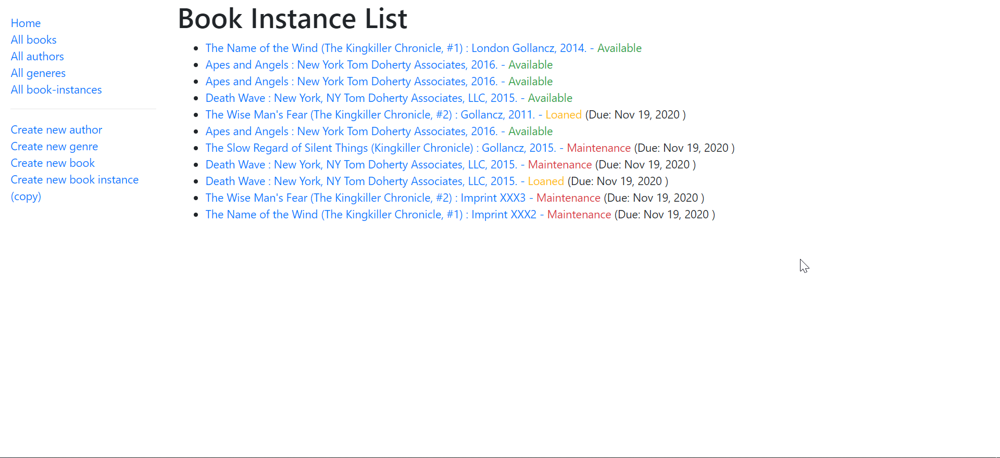

# Local Library

This is a follow up of a tutotrial from MDN with some of my own changes. The tutorial they have written is nice and you should check them out.
MDN Express Tutorial - https://developer.mozilla.org/en-US/docs/Learn/Server-side/Express_Nodejs

# Install & Run

Download the Repository and then run the following commands.

```
npm install
npm run serverstart
```

This will start a server at port 3000. Visit the link and test the various functionalities

# Screenshots

Home Page

<hr>

BookInstance Page

<hr>
